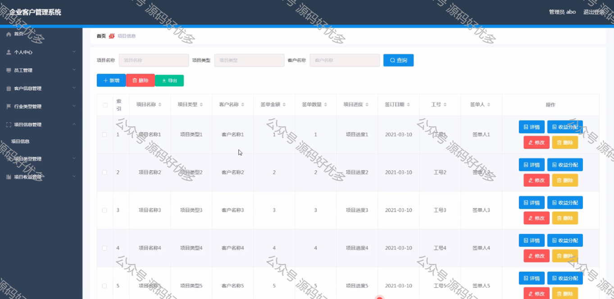

 
## 查看主页获取源码

> **作者介绍**： **✌**全网粉丝10W+本平台特邀作者、博客专家、CSDN新星计划导师、java领域优质创作者,博客之星、掘金/华为云/阿里云/InfoQ等平台优质作者、专注于毕业项目实战 **✌**

  

### 一、作品包含

源码+数据库+设计文档万字LW+PPT+全套环境和工具资源+部署教程

### 二、项目技术

前端技术：Html、Css、Js、Vue、Element-ui

数据库：MySQL

后端技术：Java、Spring Boot、MyBatis

  

### 三、运行环境

开发工具：IDEA/eclipse

数据库：MySQL8.0

数据库管理工具：Navicat10以上版本

环境配置软件： JDK1.8+Maven3.6.3

前端Nodejs：14

  

### 四、项目介绍

项目编号：springboot024

使用JAVA语言开发一个企业客户管理系统，本系统将严格按照软件开发流程进行各个阶段的工作，采用B/S架构，面向对象编程思想进行项目开发。在引言中，作者将论述企业客户管理系统的当前背景以及系统开发的目的，后续章节将严格按照软件开发流程，对系统进行各个阶段分析设计。
企业客户管理系统的主要使用者分为管理员和员工，实现功能包括管理员：首页、个人中心、员工管理、客户信息管理、行业类型管理、项目信息管理、项目类型管理、项目收益管理，员工：首页、个人中心、客户信息管理、项目信息管理、项目收益管理等功能。由于本网站的功能模块设计比较全面，所以使得整个企业客户管理系统信息管理的过程得以实现。
本系统的使用可以实现本企业客户管理的信息化，可以方便管理员进行更加方便快捷的管理，可以提高管理人员的工作效率。

### 五、运行截图

  
